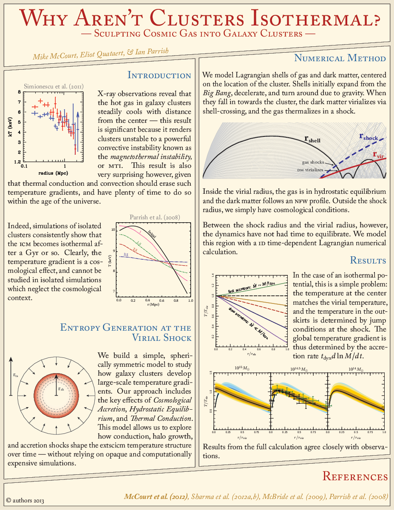
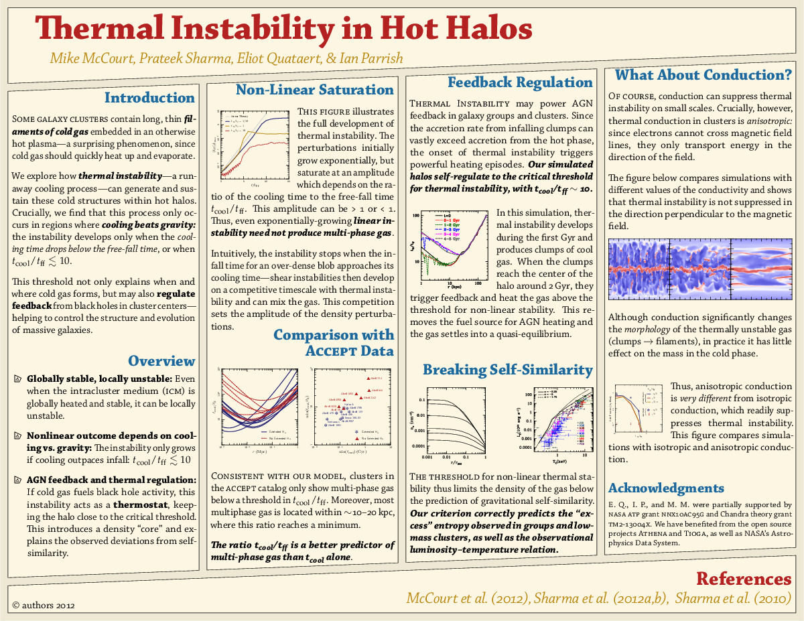
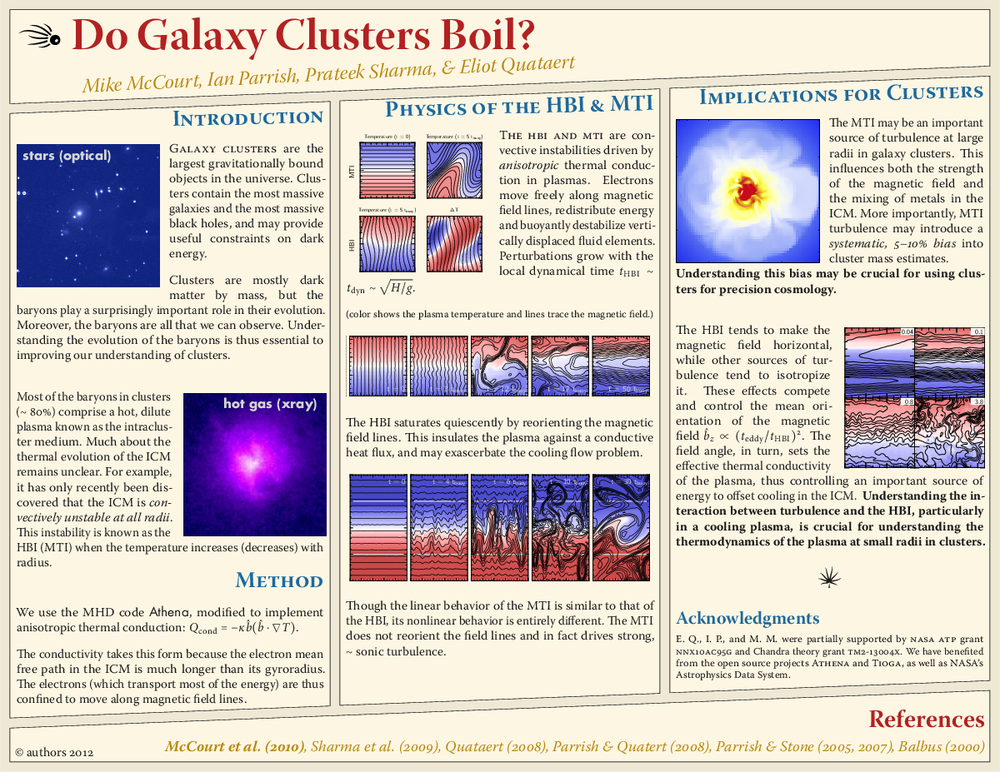

# Research Posters

These are some of my research posters from grad school.
If you like, you can compile them using [TiogaRevival](https://github.com/mkmcc/TiogaRevival), a fork of the original [Tioga](https://tioga.sourceforge.net) plotting library.

## Rasterized Images
(see directories for pdf)

